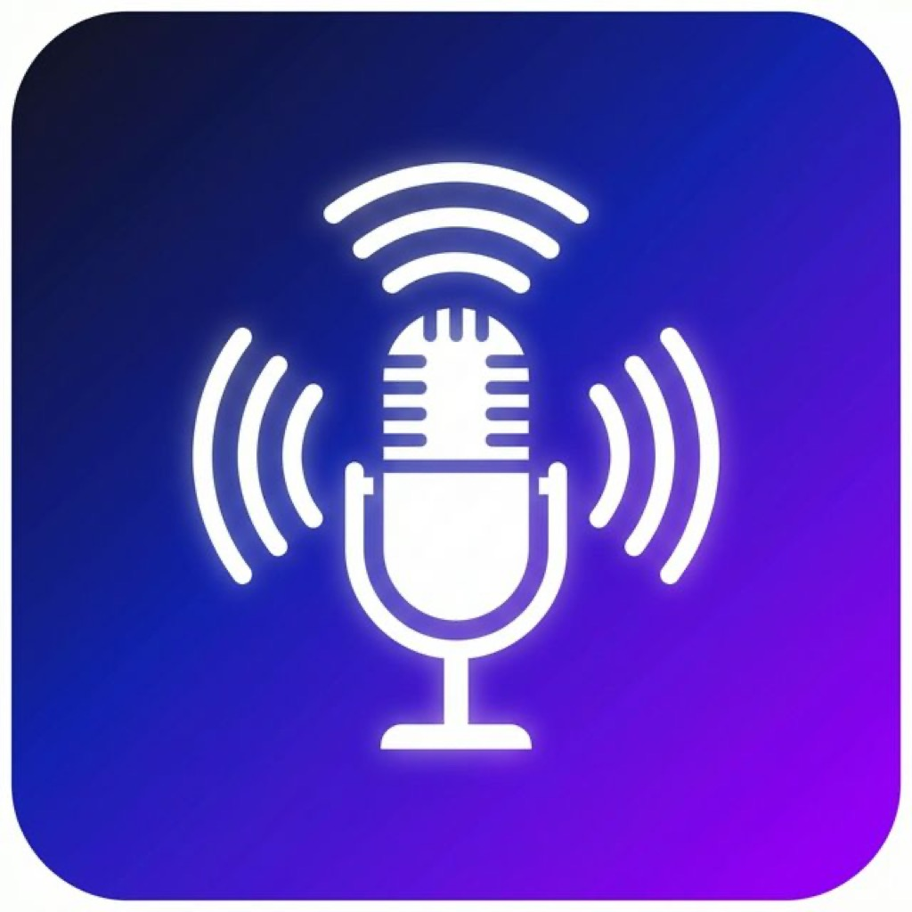

# LAN Mic

<p align="center">
  
</p>

<p align="center">
  <strong>Use your iPhone as a wireless microphone for your PC — over LAN via WebRTC.</strong>
</p>

<p align="center">
  <a href="https://github.com/iqbal-rashed/lan-mic-receiver/actions/workflows/ci.yml">
    
  </a>
</p>

---

## How It Works

```
┌──────────────┐    WebRTC (audio)    ┌───────────────────┐
│  iOS Sender  │ ◄══════════════════► │  Desktop Receiver │
│  (iPhone)    │    WebSocket (SDP)   │  (Rust / iced)    │
└──────────────┘                      └───────────────────┘
        ▲              mDNS                    ▲
        └──────── Auto-Discovery ──────────────┘
```

1. **Receiver** runs on your PC and listens for connections, advertising itself via mDNS
2. **Sender** (iOS) auto-discovers the receiver on your network, captures microphone audio, and streams it via WebRTC
3. Audio plays through the selected output device on your PC (speakers, virtual cable, etc.)

## Features

- 🔍 **Auto-Discovery** — Sender automatically finds the receiver on your LAN via Bonjour/mDNS (no manual IP entry needed)
- 🎙️ **Low-Latency Audio** — WebRTC with Opus codec for real-time, high-quality streaming
- 🔄 **Background Audio** — Sender keeps streaming even when the app is in the background
- 🔁 **Auto-Reconnect** — Optional automatic reconnection on connection drop with exponential backoff
- 💻 **System Tray** — Receiver minimizes to system tray for unobtrusive operation
- 🎧 **Virtual Audio Cable Support** — Route mic audio into Discord, OBS, Zoom, etc.

## Components

| Component | Language | Location |
|-----------|----------|----------|
| **Receiver** — Desktop app with GUI & system tray | Rust | [`receiver/`](receiver/) |
| **Sender** — iOS app with auto-discovery | Swift | [`sender/`](sender/) |

## Quick Start

### Receiver (Windows / macOS / Linux)

```bash
# Prerequisites: Rust toolchain (https://rustup.rs)
cd receiver
cargo run --release
```

The receiver window will show the WebSocket URL (e.g. `ws://192.168.1.100:9001/ws`).
It also broadcasts itself as `_lanmic._tcp` on the local network for auto-discovery.

### Sender (iOS)

1. Open `sender/Lan Mic.xcodeproj` in Xcode
2. Build and run on your iPhone (requires physical device for microphone)
3. The receiver should appear automatically in the **Receivers** list
4. Tap the receiver to auto-fill IP/port, then tap **Connect**
5. Or enter the IP address manually if auto-discovery is unavailable

> **Tip:** The sender remembers the last used IP and port across launches.

### Virtual Audio Cable (Optional)

To route microphone audio into other apps (Discord, OBS, etc.), use a virtual audio device:

| Platform | Tool |
|----------|------|
| macOS | [VB-Cable](https://vb-audio.com/Cable/) or [BlackHole](https://github.com/ExistentialAudio/BlackHole) |
| Windows | [VB-Cable](https://vb-audio.com/Cable/) |
| Linux | PulseAudio null sink |

Select the virtual cable as the output device in the receiver, then set it as the input in your target app.

## Tech Stack

- **WebRTC** for real-time, low-latency audio transport
- **Opus** codec for high-quality audio compression
- **WebSocket** for SDP/ICE signaling
- **mDNS/Bonjour** for automatic receiver discovery on LAN
- **iced** for the receiver's cross-platform GUI
- **cpal** for audio output
- **Network.framework** (`NWBrowser`) for iOS-side service discovery

## Building

### Receiver

```bash
cd receiver
cargo build --release
```

**Linux dependencies:**
```bash
sudo apt-get install cmake pkg-config libasound2-dev libfontconfig1-dev libwayland-dev libxkbcommon-dev
```

### Sender

Open in Xcode and build for a physical device (microphone requires real hardware).

**Requirements:** iOS 14+, Xcode 15+

## Architecture

```
sender/
├── Lan Mic/
│   ├── Lan_MicApp.swift           # App entry point
│   ├── ContentView.swift          # Main UI with discovery & controls
│   ├── Audio/
│   │   └── AudioSessionManager.swift   # Audio session & background support
│   ├── Discovery/
│   │   └── ReceiverDiscovery.swift      # Bonjour/mDNS auto-discovery
│   ├── Signaling/
│   │   └── SignalingClient.swift        # WebSocket signaling with keepalive
│   ├── ViewModel/
│   │   └── ConnectionViewModel.swift    # State management & orchestration
│   └── WebRTC/
│       └── WebRTCManager.swift          # WebRTC peer connection (audio-only)

receiver/
├── src/
│   ├── main.rs              # Entry point, system tray setup
│   ├── app.rs               # iced GUI application
│   ├── icon.rs              # Programmatic icon generation
│   ├── audio/mod.rs         # Audio output via cpal
│   └── core/
│       ├── mod.rs            # Core runtime & shared state
│       ├── signaling.rs      # WebSocket server + mDNS registration
│       └── signaling/
│           └── webrtc_session.rs  # WebRTC session handling
```

## License

MIT
